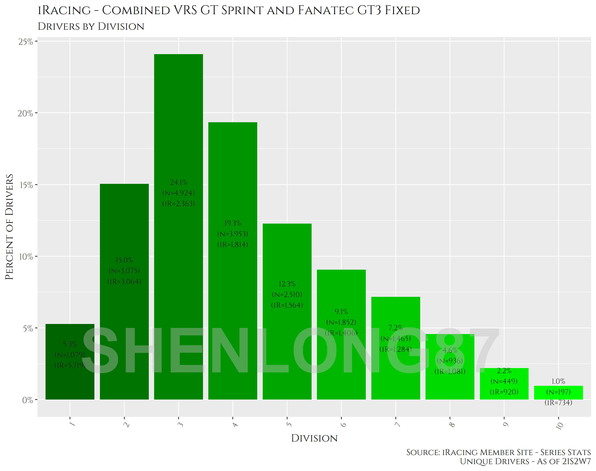

```{r setup, include=FALSE}
knitr::opts_chunk$set(echo = FALSE)
library(knitr)
library(ggplot2)
library(png)

```

# R Markdown {.tabset}

This is an R Markdown document. Markdown is a simple formatting syntax for authoring HTML, PDF, and MS Word documents. For more details on using R Markdown see <http://rmarkdown.rstudio.com>.

When you click the **Knit** button a document will be generated that includes both content as well as the output of any embedded R code chunks within the document. You can embed an R code chunk like this:

```{r cars}
summary(cars)
```

## Testing Header 2

This is an R Markdown document. Markdown is a simple formatting syntax for authoring HTML, PDF, and MS Word documents. For more details on using R Markdown see <http://rmarkdown.rstudio.com>.

The custom CSS file has been used to change the style of the document. Here is an example table:

```{r table}
knitr::kable(mtcars[1:5, 1:5], caption = "An example table")
```

# Including Plots

You can also embed plots, for example:

```{r pressure, echo=FALSE}
plot(pressure)
```


## Testing the image with an R chunk from a png file

```{r, fig.retina=3}

img1_path<- "./ir.clubname.ovr.png"
knitr::include_graphics(img1_path)

```

## Testing the image with a ggplot object one two three four

<!-- # ```{r echo=FALSE, warning=FALSE, out.width = "100%"} -->
<!-- # ir.clubname.ovr.2 -->
<!-- # ``` -->


Note that the `echo = FALSE` parameter was added to the code chunk to prevent printing of the R code that generated the plot.

## Testing an image with HTML image inserting
This is a test to insert an image to the report



After the image there is a table


<div class="tocify-extend-page" data-unique="tocify-extend-page" style="height: 200;"></div>